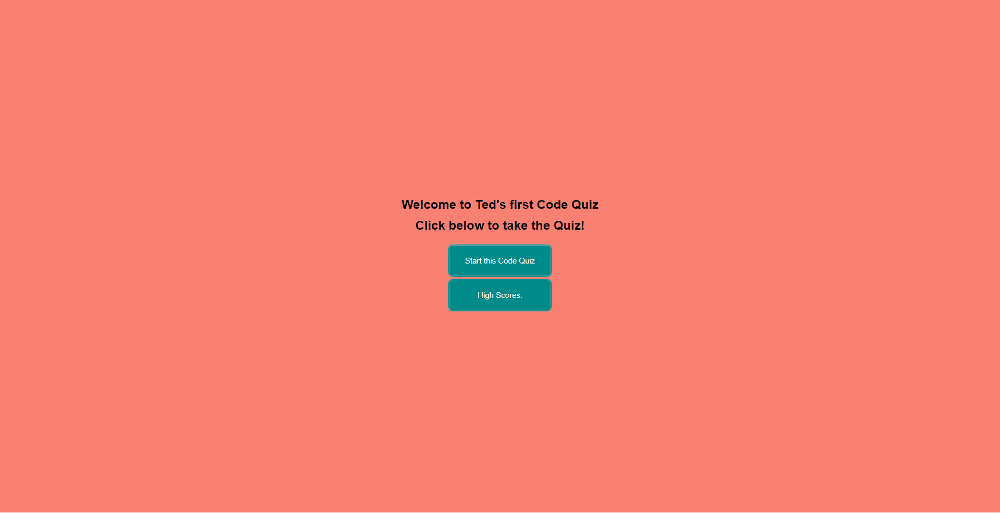

# code-quiz
[Launch Code Quiz](https://theodoreshishkovskiy.github.io/code-quiz/)

## Table of Contents
1. [Description](#Description)
2. [Visuals](#visuals)

## Description
This webpage was created to practice javascript. When you launch the webpage it is a quiz about coding knowledge. The javascript is set up to have the quiz save highscores and return to the start of quiz to play again.
[Link to live site]https://theodoreshishkovskiy.github.io/password-generator/

## Visuals

